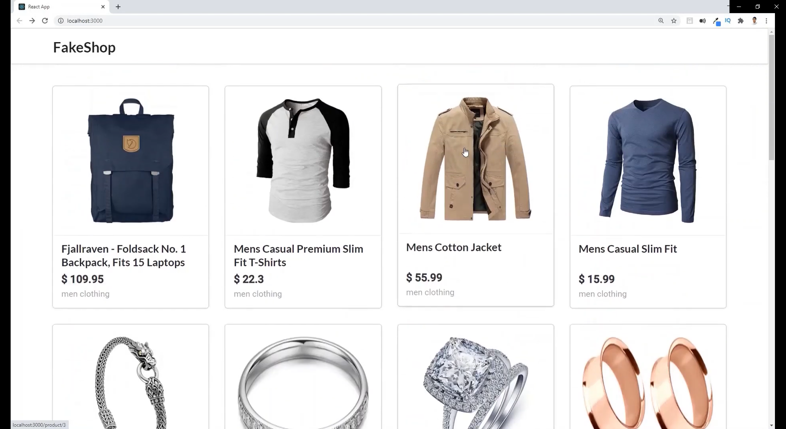

# Fake Shop with React & Redux




## Install Packages
```
npm install axios
npm install react-router-dom
```

## Clean Boilerplate
```
import './App.css';

function App() {
  return (
    <div className="App">
      <h1>Hello</h1>
    </div>
  );
}

export default App;
```

## Add Semantic UI for Stylings
In == public/index.html == add the following in the head section:
```
<link rel="stylesheet" href="assets/semantic.min.css">
<script src="assets/semantic.min.js"></script>
```

